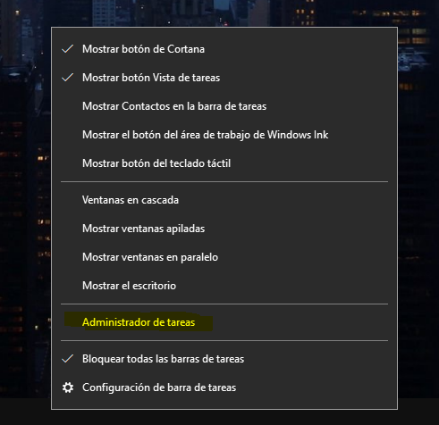
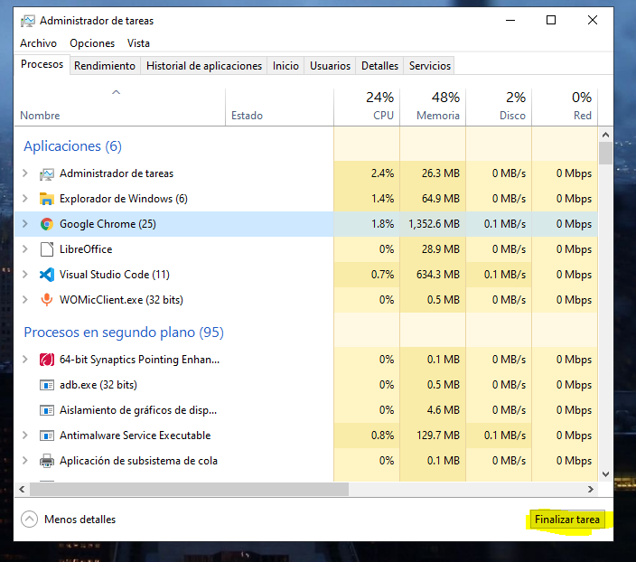

# kill google chrome in windows

This is a support document for darideveloper projects, which require to kill google chrome process

--------------------------------

1. If you don't have any google chrome window open, open it

2. Open the task manager: right clicking on the taskbar > "task manager"

3. Select the first google chrome icon

4. Click on "end task"

5. Done. Now you can use google chrome in the project