# Generate gmail application password

This is a support document for darideveloper projects, which require to send emails with gmail

--------------------------------

1. Go to https://myaccount.google.com/

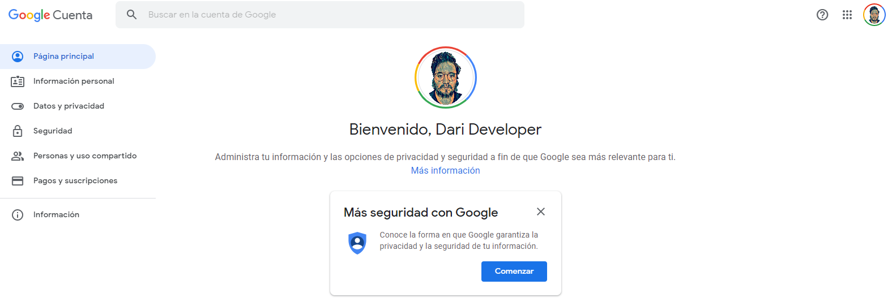

2. Make sure you use the correct user account

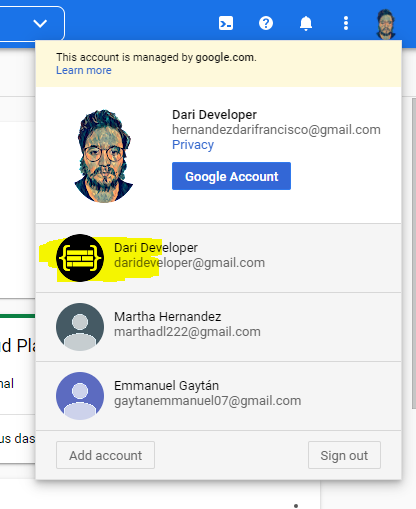

3. Go to "Security"

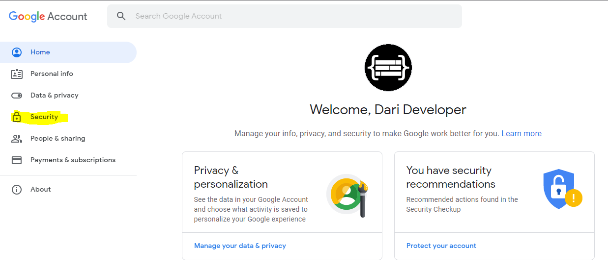

4. Activate the 2-Step Verification

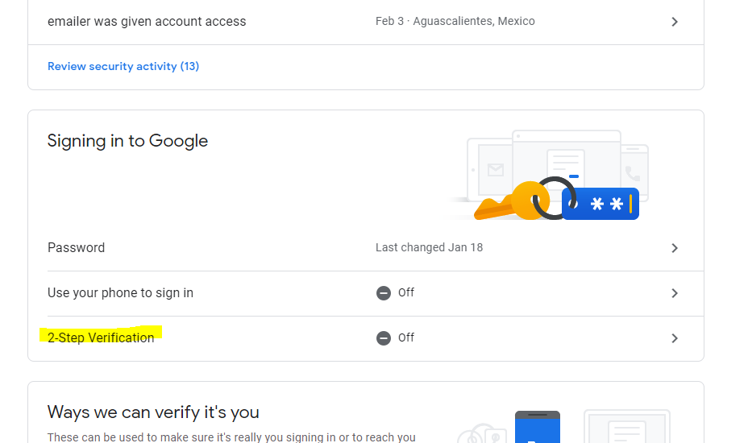
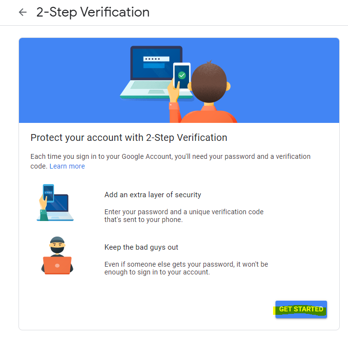
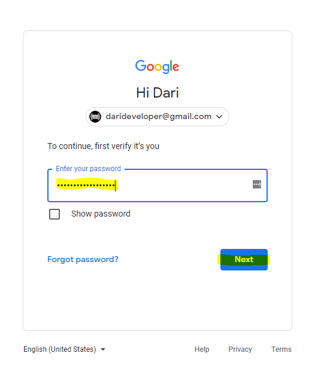
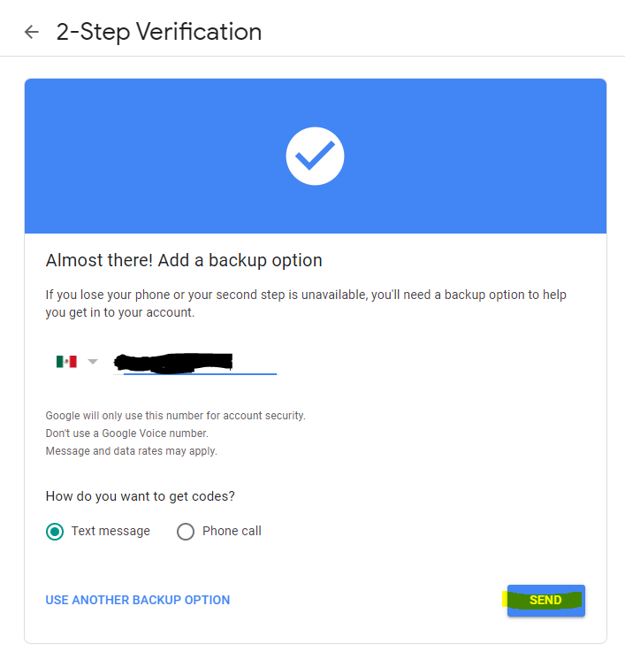
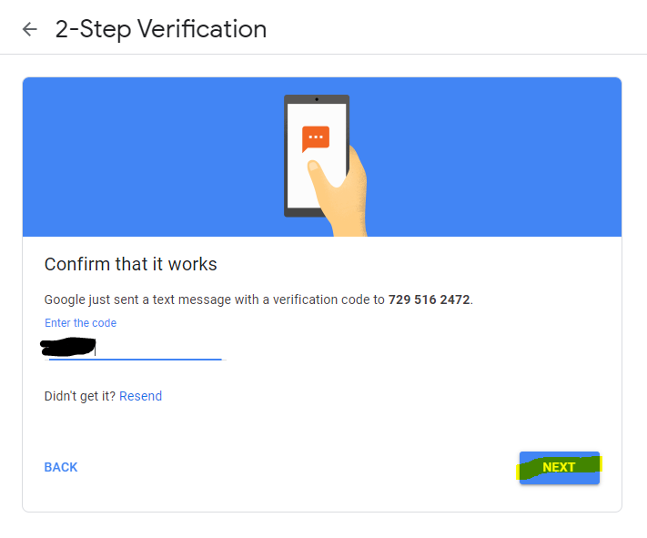
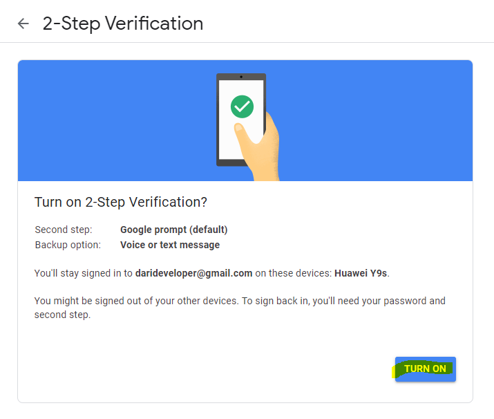
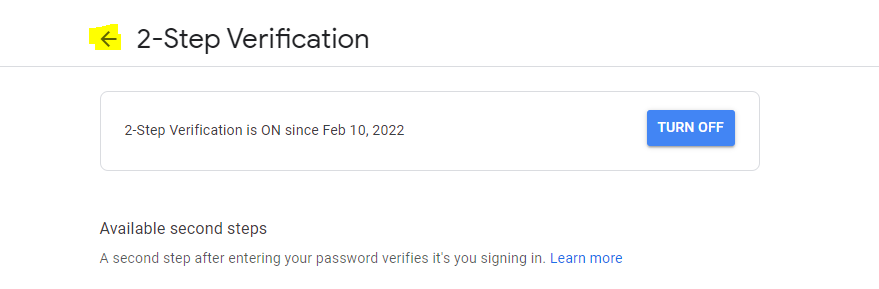

5. Go to App Passwords page

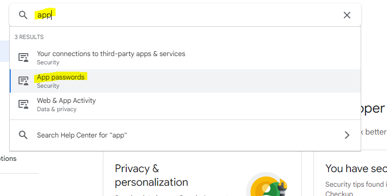
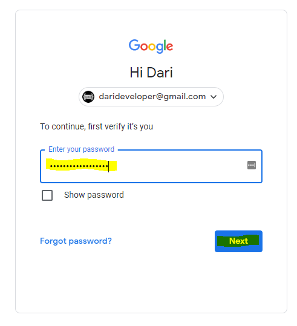

6. Select "mail" app

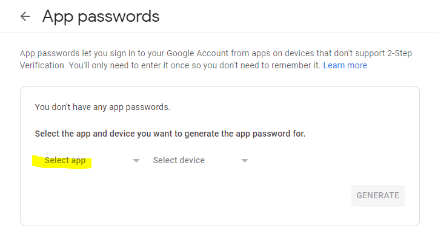
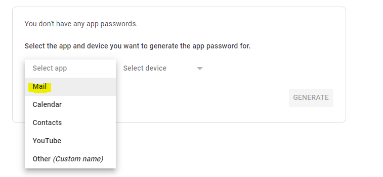

7. Select "other" devaice

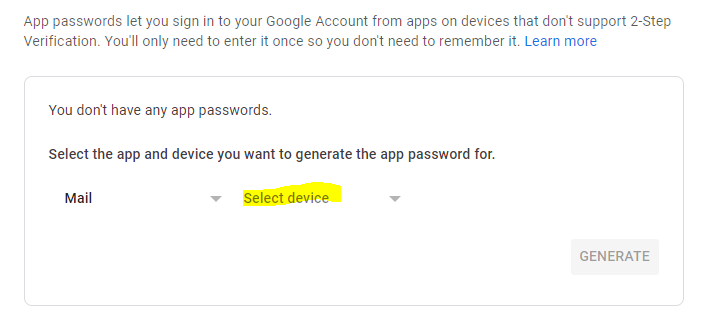
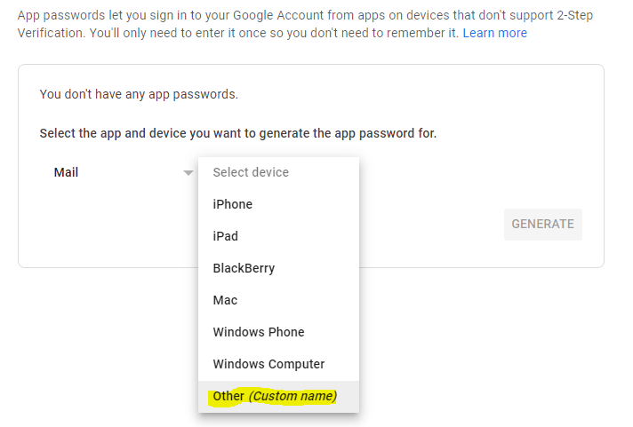

8. Type your project name and click in "GENERATE" button

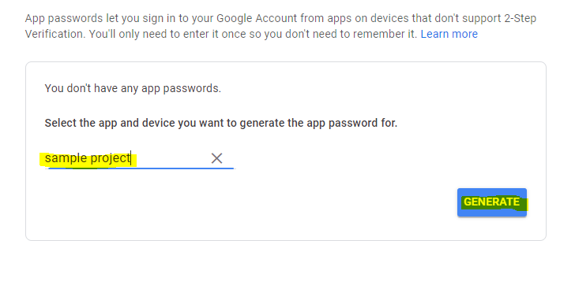

9. Done.
This is your new Application password. 
Copy and save it. 
Now you can use it in for send emails, instead of you real passwords.

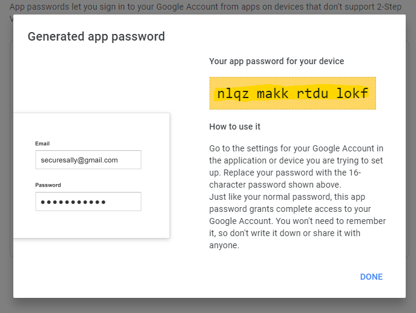