# generate google sheets api key

This is a support document for darideveloper projects, which require connection with google spreadsheets

--------------------------------

In order to connect the project with google spreadsheets, you need to generate an API Key from the google console. Below are the steps.

1. Go to your Google Clud COnsole home screen: https://console.cloud.google.com/home/

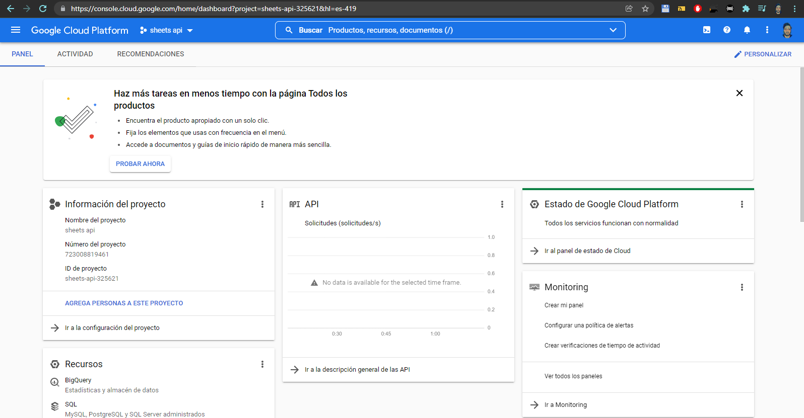

2. Make sure you use the correct user account

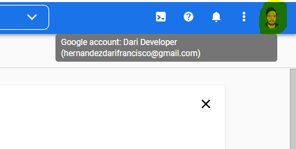

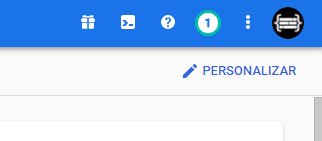

3. Create a new project

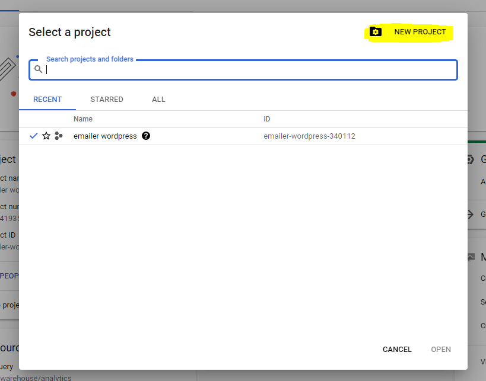

4. Name the new project as "sheets" or something similar

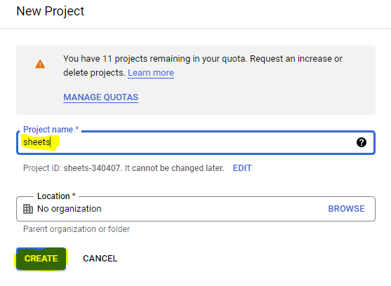

5. Select the project you just created

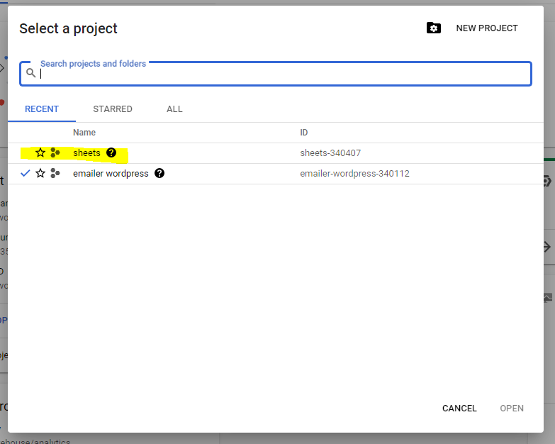

6. Go to APIs & Services > Credentials

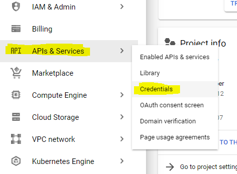

7. Create a new Service account

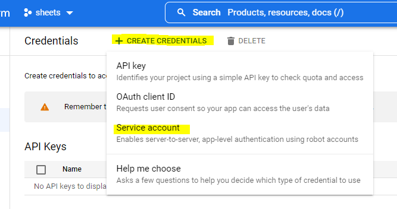

8. Give it the name "service sheets"

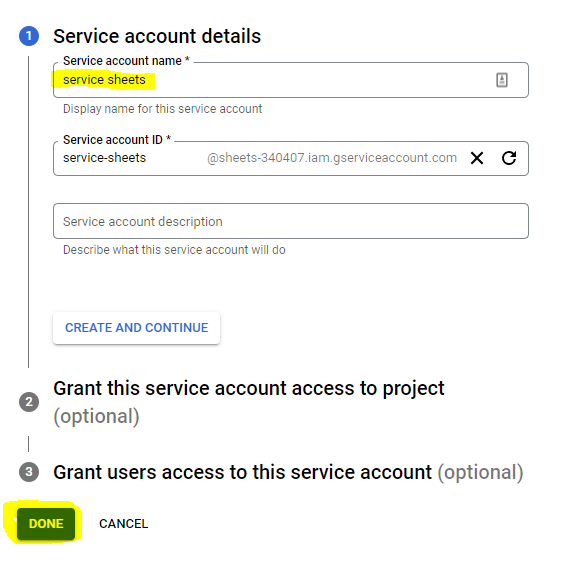

9. Edit the generated service account

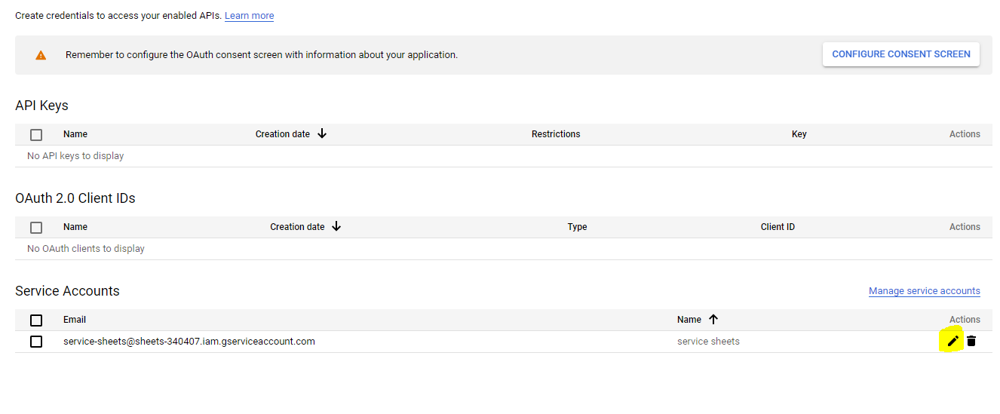

10. In keys tab, create a new key

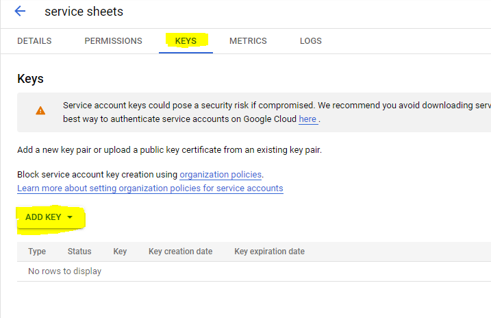

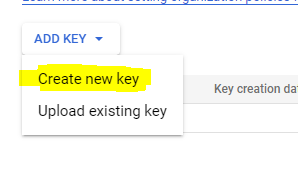

11. Select json and click in the "create" button

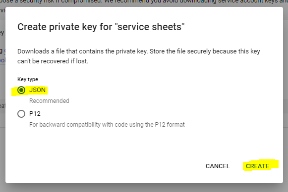

12. Save the Json file a in secure place

13. Search "sheets" in the top search bar

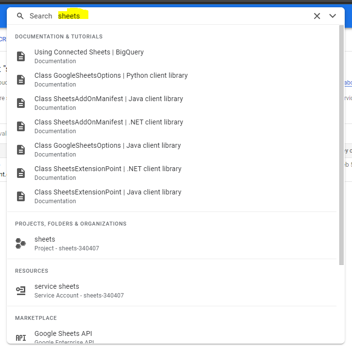

14. In the Marketplace results, select "Google Sheets API"

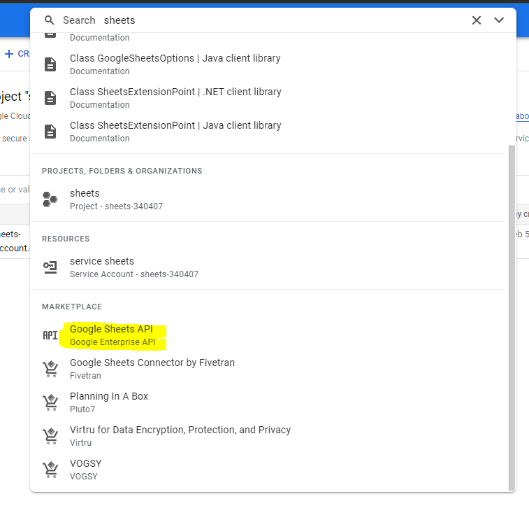

15. Enable it

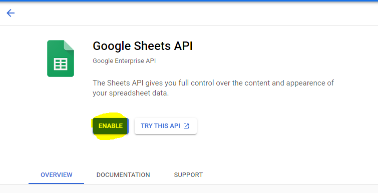

16. Done. Now, with yout json file, you can connect the project with yor google sheets