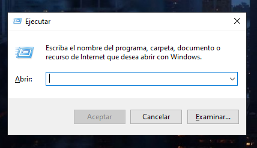
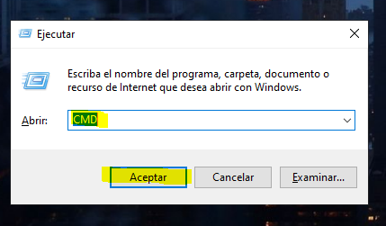
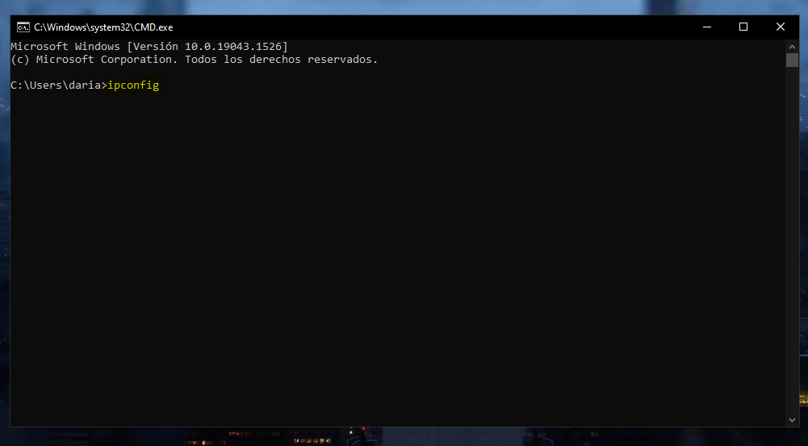
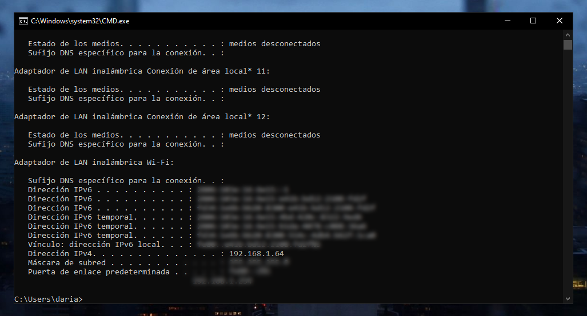

# Get my local IP in windows

This is a support document for darideveloper projects, which require the IP address of specific windows PC, in the same network
--------------------------------

1. Press the "Windows" and "R" keys at the same time 

2. Type "CMD" and press the enter key (or click the "Accept" button)

3. In the CMD, type "ipconfig"

4. Done. 
Your local IP Address is the line "IPv4 address".
In my case: *192.168.1.64*.
Save it.

