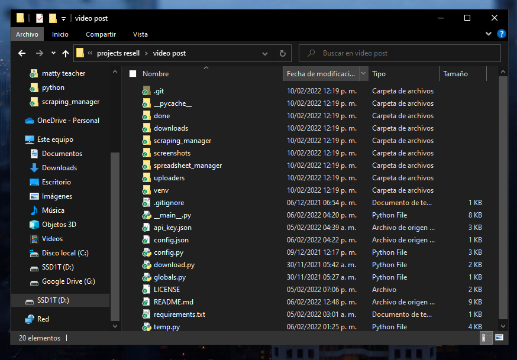
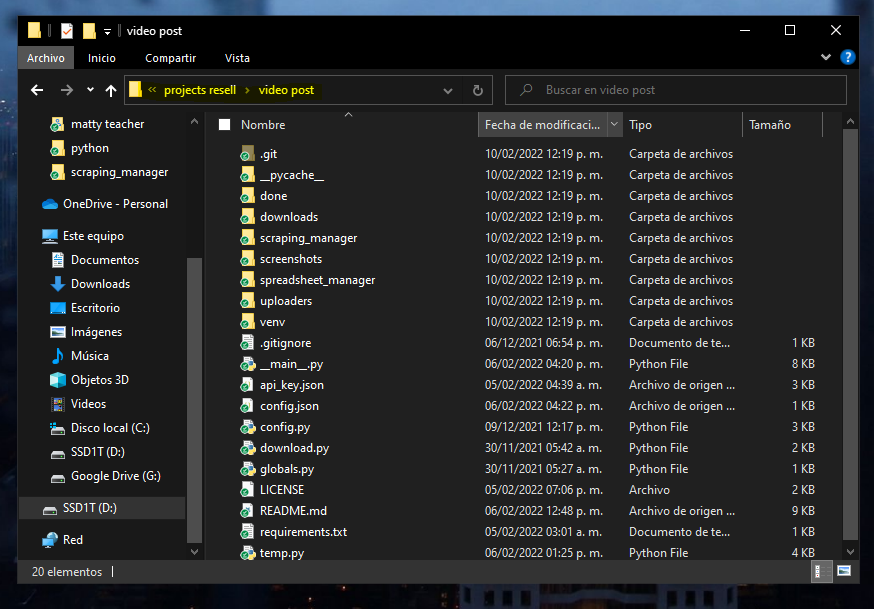
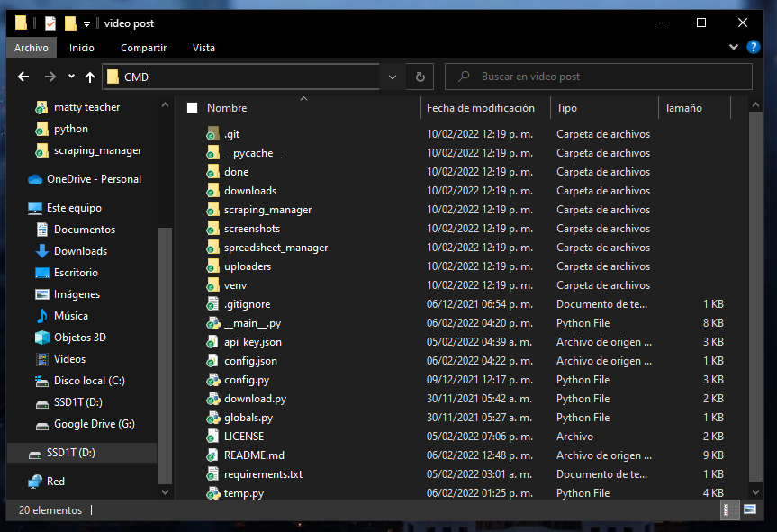
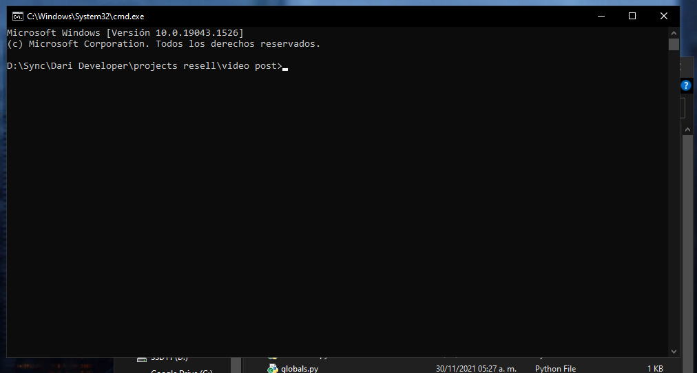
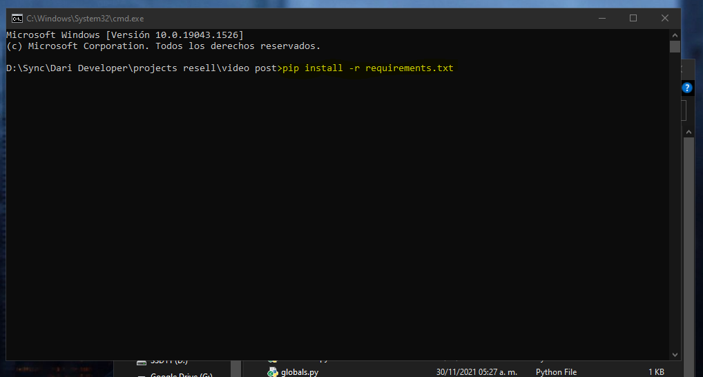

# Open terminal (cmd) in project folder in windows

This is a support document for darideveloper projects, open the terminal (or cmd) in project folder

--------------------------------

1. Open folder in file explorer

2. Click in address bar

3. Type "CMD" en Enter.

4. Done. 
Now you can install the python modules or run the project in the pop window

Sample: 

