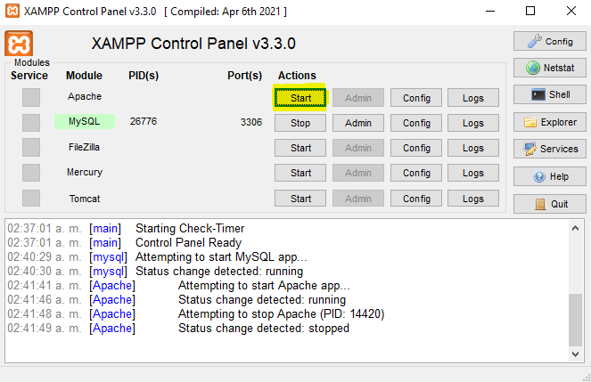
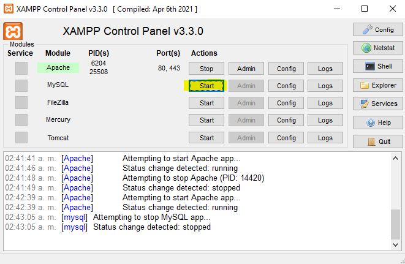
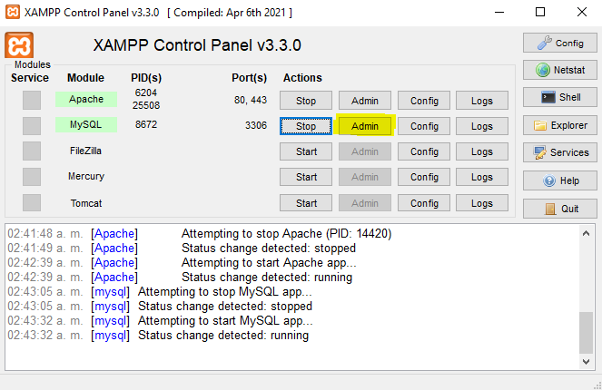
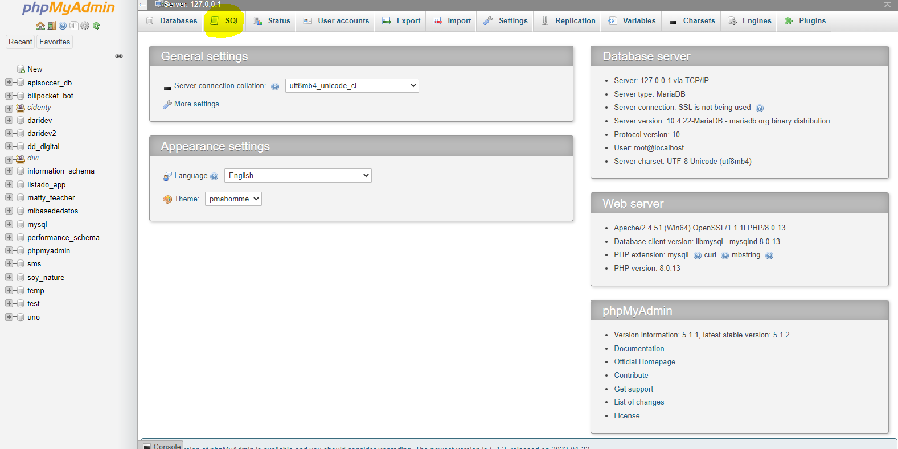
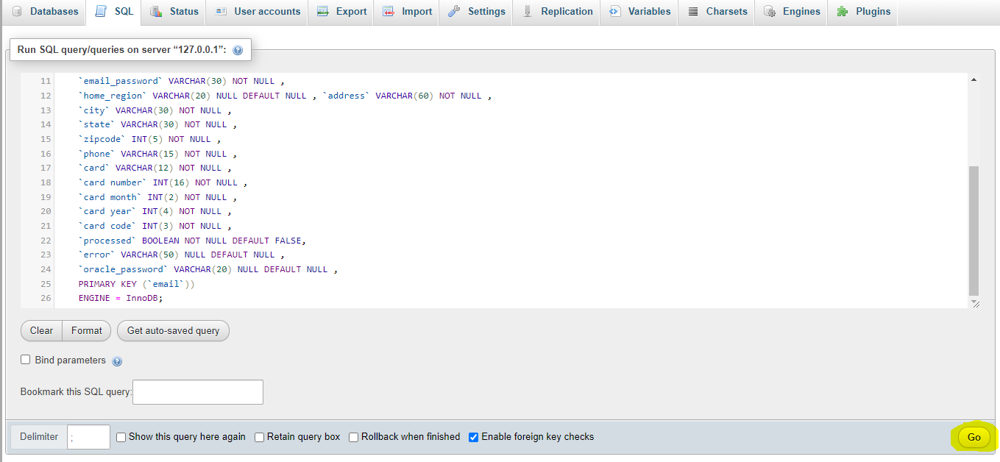

# Run SQL in XAMPP - phpMyAdmin

This is a support document for darideveloper projects, which require to run SQL Queries with phpMyAdmin, installed with XAMPP

--------------------------------

1. Open XAMPP and Start Apache

2. Start MySQL

3. Open the MySQL Admin panel

4. In phpMyAdmin (mysql panel), go to *sql* tab

5. Copy the content of the .sql file, and paste it in the main section

6. Click in the *Go* button 

