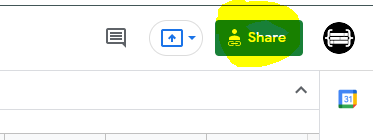
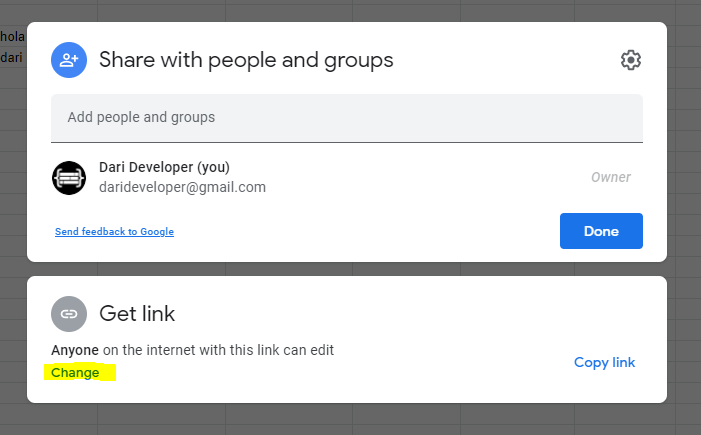
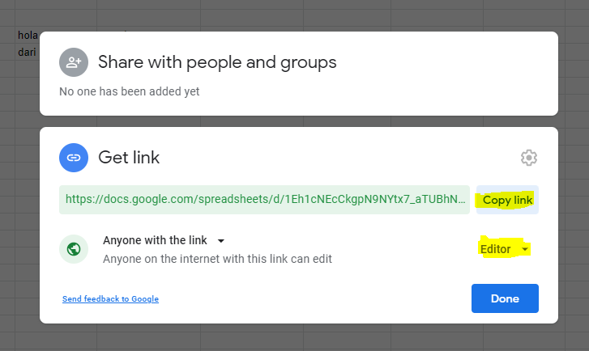

# Share google sheet with edit permissions

This is a support document for darideveloper projects, which require to share a gogole sheet for connect it with the project.

--------------------------------

1. Open the google sheet

2. Click in "share" button

3. Click in "change" link from the "get link" section

4. Be sure to have it as "editor" and copy the link

